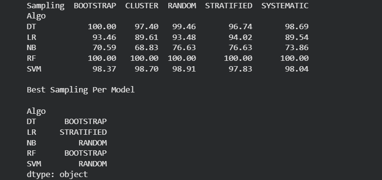

# Predictive-Analysis

# Credit Card Fraud Detection Using Sampling and Machine Learning

---

## Overview
This project evaluates the impact of different sampling techniques on machine learning models for detecting fraudulent credit card transactions.  
Because fraud datasets are highly imbalanced, Random Oversampling is applied before training the models.

---

## Dataset Information
- Dataset Name: CreditCard_data.csv  
- Target Column: Class  
  - 0 → Legitimate Transaction  
  - 1 → Fraudulent Transaction  

---

## Technologies and Libraries
- Python  
- pandas  
- numpy  
- scikit-learn  
- imbalanced-learn  

---

## Data Preprocessing
1. Features and target variable are separated.
2. Dataset imbalance is handled using Random Oversampling.
3. Sampling techniques are applied to the balanced dataset.
4. Feature values are standardized using StandardScaler.
5. Data is split into training and testing sets.

---

## Sampling Techniques
- Random Sampling  
- Systematic Sampling  
- Stratified Sampling  
- Cluster Sampling  
- Bootstrap Sampling  

---

## Machine Learning Models
- Logistic Regression  
- Decision Tree Classifier  
- Random Forest Classifier  
- Naive Bayes  
- Support Vector Machine  

---

## Model Evaluation
- Evaluation Metric: Accuracy  
- Each model is evaluated using all sampling techniques.
- Performance results are summarized in a comparison table.
- The best sampling technique is identified for each model.

---

## Output
- Accuracy comparison table (Model × Sampling Technique)
- Best sampling technique for each model



---

## How to Run
```bash
pip install pandas numpy scikit-learn imbalanced-learn
